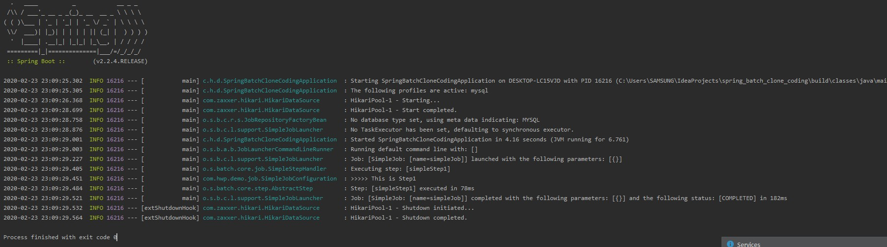
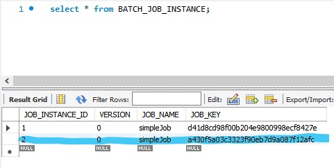
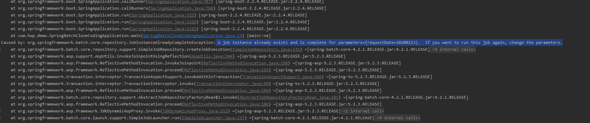

# Spring Batch 샘플 프로젝트 생성
jojoldu님의 Spring Batch 가이드를 따라 치는중입니다.  
- https://jojoldu.tistory.com/326?category=635883
- '2. Batch Job 실행해보기, 3. 메타테이블 엿보기' 진행중


## mysql 연결 후 실행
  
application.yml을 작성한 후  
schema-mysql.sql파일의 쿼리문으로 mysql에 메타테이블을 생성했습니다.



이제 프로그램이 정상 실행된 것을 볼 수 있습니다.

### 주요 메타 테이블

1. BATCH_JOB_INSTANCE  
    - 배치에서 제일 처음 쓰는 테이블일까? 아닐듯
    - Job Parameter에 따라 생성되는 테이블
    - Job을 한 번 성공시키면 같은 Parameter로는 더 실행이 불가능하다.
    - 네이밍 이해: 마치 Java의 class로 여러 instance를 생성하는 것과 비슷하다.
    
    Job Parameter에 따라 생성되는 테이블  
    Job Parameter란, Spring Batch가 실행될 때 외부에서 받을 수 있는 파라미터  
    (예: 특정 날짜를 잡 파라미터로 넘기면 해당 데이터를 조회/가공/입력 등의 작업을 할 수 있다.)  
    
    - parameter를 다르게 받은 경우
    
    
    
    
    
    파라미터가 다른 값으로 실행할 경우 메타 테이블에 새로운 job instance가 추가 됩니다.
     
     
    
    같은 파라미터로는 Job을 실행할 수 없습니다.
    
    Job Instance 테이블 네이밍이 적절한 것이
    마치 Java의 Class로 여러 Instance가 생성되는 것과 비슷해 보입니다.

2. BATCH_JOB_EXECUTION
    - JOB_INSTANCE가 성공/실패한 모든 내역을 가지고 있음.
    - 컬럼: 1번 테이블과 JOB_INSTANCE_ID를 공유하며, 인스턴스 id로 성공, 실패를 확인 가능.  
      (STATUS, EXIT_CODE, EXIT_MESSAGE)
    - 성공한 기록이 있을때만 같은 param으로 재수행이 안된다.

3. BATCH_JOB_EXECUTION_PARAMS
    - job이 실행될 때 입력받은 param을 저장하는 테이블
    - param이 null인 job은 들어가있지 않음.

4. 기타 테이블
    - Spring Batch 재시도/SKIP 전략편에서 자세하게 소개

- 나중엔 테스트 코드를 가지고 spring batch 예제를 작성하게 될 것인데,
  지금 당장 그렇게 하지 않는 이유는, metaData가 남지 않기 때문입니다.
  (Job Instance Context 문제를 겪는다 함.)
  후반엔 H2를 이용한 테스트 코드를 작성할 것.
  
  

### Next
step을 순차적으로 연결시킬 때 사용된다.

원하는 Job만 실행시키려면
1. application.yml에 내용 추가
    ```
    spring.batch.job.names: ${job.name:NONE}
    ```
    - job.name이 있으면 그걸 할당하고, 없으면 NONE을 할당한다는 뜻
    - NONE이 할당되면 어떤 배치도 실행하지 않겠다는 의미(배치 실행을 막는 역할)

2. program argument에 아래 내용 추가
    ```    
    --job.name=stepNextJob version=2
    ``` 

* 실제 운영 환경에서는 java -jar batch-application.jar --job.name=simpleJob 과 같이 배치를 실행합니다.

### 조건별 흐름 제어(Flow)
- next는 앞의 step에서 오류가 나면 나머지 뒤에 있는 step 들은 실행되지 못한다.
- 상황에 따라 오류/정상에 따라 행동분기를 나누고 싶을 때 사용한다.

1. on()
    - 캐치할 ExitStatus 지정
    - * 일 경우 모든 ExitStatus가 지정
2. to()
    - 다음으로 이동할 Step 지정
3. from()
    - 일종의 이벤트 리스너 역할
    - 상태값을 보고 일치하는 상태라면 to()에 포함된 `step`을 호출
    - step1의 이벤트 캐치가 FAILED로 되있는 상태에서 추가로 이벤트 캐치하려면 from을 써야 함
4. end()
    - end는 FlowBuilder를 반환하는 end와 FlowBuilder를 종료하는 end 2개가 있음
    - on("*")뒤에 있는 end는 FlowBuilder를 반환하는 end
    - build() 앞에 있는 end는 FlowBuilder를 종료하는 end
    - FlowBuilder를 반환하는 end 사용시 계속해서 from을 이어갈 수 있음
    
- on이 캐치하는 상태값은 BatchStatus가 아닌 ExitStatus라는 점!!
- 분기 처리를 위해 상태값 조정이 필요하다면 ExitStatus를 조정해야 한다.

