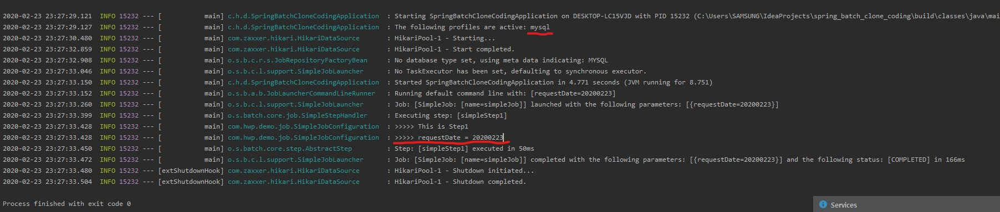

# Spring Batch 샘플 프로젝트 생성
jojoldu님의 Spring Batch 가이드를 따라 치는중입니다.  
- https://jojoldu.tistory.com/326?category=635883
- '2. Batch Job 실행해보기, 3. 메타테이블 엿보기' 진행중

## mysql 연결 후 실행
  
application.yml을 작성한 후  
schema-mysql.sql파일의 쿼리문으로 mysql에 메타테이블을 생성했습니다.

이제 프로그램이 정상 실행된 것을 볼 수 있습니다.

### 주요 메타 테이블

1. BATCH_JOB_INSTANCE  
    - 배치에서 제일 처음 쓰는 테이블일까? 아닐듯
    - Job Parameter에 따라 생성되는 테이블
    - Job을 한 번 성공시키면 같은 Parameter로는 더 실행이 불가능하다.
    - 네이밍 이해: 마치 Java의 class로 여러 instance를 생성하는 것과 비슷하다.
    
    Job Parameter에 따라 생성되는 테이블  
    Job Parameter란, Spring Batch가 실행될 때 외부에서 받을 수 있는 파라미터  
    (예: 특정 날짜를 잡 파라미터로 넘기면 해당 데이터를 조회/가공/입력 등의 작업을 할 수 있다.)  
    
    - parameter를 다르게 받은 경우
    
    
    
    
    
    파라미터가 다른 값으로 실행할 경우 메타 테이블에 새로운 job instance가 추가 됩니다.
     
     
    
    같은 파라미터로는 Job을 실행할 수 없습니다.
    
    Job Instance 테이블 네이밍이 적절한 것이
    마치 Java의 Class로 여러 Instance가 생성되는 것과 비슷해 보입니다.

2. BATCH_JOB_EXECUTION
    - JOB_INSTANCE가 성공/실패한 모든 내역을 가지고 있음.
    - 컬럼: 1번 테이블과 JOB_INSTANCE_ID를 공유하며, 인스턴스 id로 성공, 실패를 확인 가능.  
      (STATUS, EXIT_CODE, EXIT_MESSAGE)
    - 성공한 기록이 있을때만 같은 param으로 재수행이 안된다.

3. BATCH_JOB_EXECUTION_PARAMS
    - job이 실행될 때 입력받은 param을 저장하는 테이블
    - param이 null인 job은 들어가있지 않음.

4. 기타 테이블
    - Spring Batch 재시도/SKIP 전략편에서 자세하게 소개

- 나중엔 테스트 코드를 가지고 spring batch 예제를 작성하게 될 것인데,
  지금 당장 그렇게 하지 않는 이유는, metaData가 남지 않기 때문입니다.
  (Job Instance Context 문제를 겪는다 함.)
  후반엔 H2를 이용한 테스트 코드를 작성할 것.
  